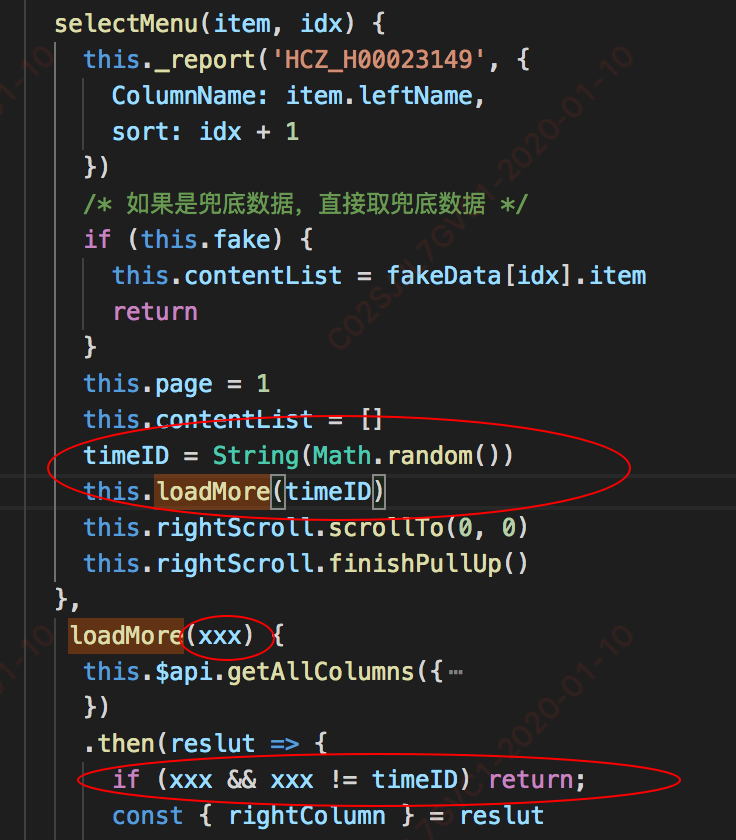

# html/js

## 安卓部分机型，圆形不圆
1. 因为用了px转换vw或rem问题，所有圆形不圆。只能写死px解决
```css
width: 10PX;
height: 10PX;
border-raidus: 10PX;
```


2. 用svg
  ```html
  <svg @click.stop="setPosition" class="control__playback-time-indicator">
                  <circle :cx="progressStyle" stroke-width="4vw" stroke="transparent" @touchstart="onThumbTouchStart" cy="2vw" r="2vw" fill="white" />
                </svg>
  ```
  

## 防止手机中网页放大和缩小
```html
<meta name="viewport" content="width=device-width,initial-scale=1.0,maximum-scale=1.0,user-scalable=0" />
```

## apple-mobile-web-app-capable 全屏模式

apple-mobile-web-app-capable是设置Web应用是否以全屏模式运行。

说明：

如果content设置为yes，Web应用会以全屏模式运行，反之，则不会。content的默认值是no，表示正常显示。你可以通过只读属性window.navigator.standalone来确定网页是否以全屏模式显示。

## format-detection

format-detection 启动或禁用自动识别页面中的电话号码

```html
<meta name="format-detection" content="telephone=no">

<meta name="format-detection" content="telephone=no,date=no,address=no,email=no,url=no" />
```

## html5调用安卓或者ios的拨号功能

```js
<a href="tel:10010">10010</a>
```


## Retina屏的1px边框

百度

## webkit mask() 兼容处理

[蒙层](https://www.baidu.com/s?ie=UTF-8&wd=WebkitMask)

某些低端手机不支持css3 mask，可以选择性的降级处理。

比如可以使用js判断来引用不同class：


> ```
> if( 'WebkitMask' in document.documentElement.style){
>  alert('支持mask');
> } else {
>  alert('不支持mask');
> }
> ```


## 设置缓存

<meta http-equiv="Cache-Control" content="no-cache" />

手机页面通常在第一次加载后会进行缓存，然后每次刷新会使用缓存而不是去重新向服务器发送请求。如果不希望使用缓存可以设置no-cache。


## visibilitychange 

浏览器标签页被隐藏或显示的时候会触发visibilitychange事件


## 贪婪模式 以最后一次提交为准



大概思路
全局变量timeID
然后通过闭包参数 xxx 与 最新的 timeID 对比。
就知道最后一次的点击请求

## video

### 获取时长
最好设置延时器，因为有些手机来回切页面，会存在获取不了时长问题。
```js
setTimeout(() => {
  this.totalDuration = convertTimeHHMMSS(window.parseInt(this.videoObj.duration) || 0)
}, 1000)
```

### poster
移动端有些手机不支持poster 封面图，建议自己写img标签