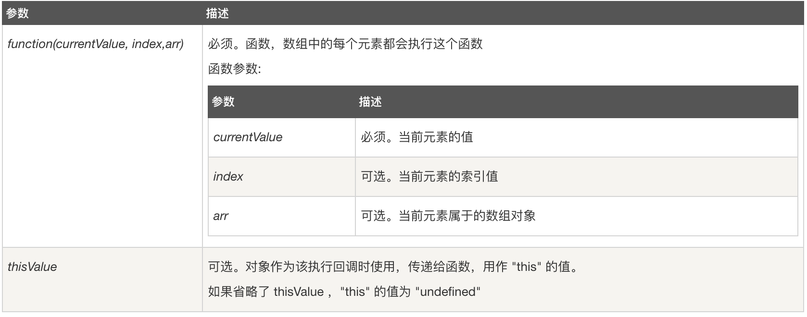
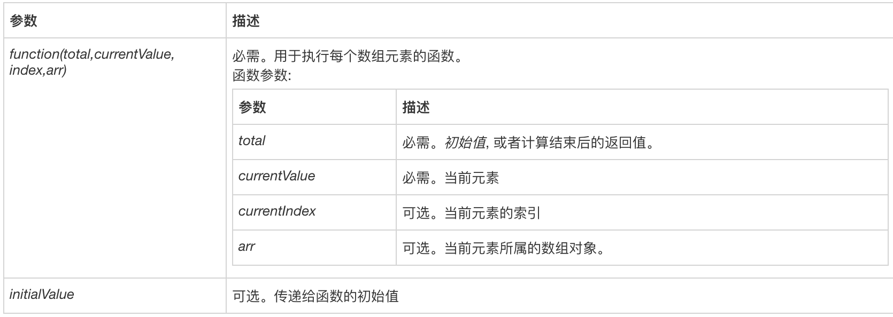

# 数组

## indexOf
  - #### 含义：
    
    该方法将从头到尾地检索数组，看它是否含有对应的元素。开始检索的位置在数组 start 处或数组的开头（没有指定 start 参数时）。如果找到一个 item，则返回 item 的第一次出现的位置。开始位置的索引为 0。

    如果在数组中没找到指定元素则返回 -1。

  - #### 用法
    array.indexOf(item,start)

    - item
      必须。查找的元素。

    - start
      可选的整数参数。规定在数组中开始检索的位置。它的合法取值是 0 到 stringObject.length - 1。如省略该参数，则将从字符串的首字符开始检索。

  - #### 返回值
    Number

    元素在数组中的位置,如果没有搜索到则返回 -1

## sort
  - #### 含义：
    sort() 方法用于对数组的元素进行排序。

    排序顺序可以是字母或数字，并按升序或降序。

    默认排序顺序为按字母升序。

    注意：当数字是按字母顺序排列时"40"将排在"5"前面。

    使用数字排序，你必须通过一个函数作为参数来调用。

    函数指定数字是按照升序还是降序排列。

    这些说起来可能很难理解，你可以通过本页底部实例进一步了解它。
  - #### 用法
    array.sort(sortfunction)

    - sortfunction
      可选。规定排序顺序。必须是函数。

  - #### 返回值
    Array

    对数组的引用。请注意，数组在原数组上进行排序，不生成副本。

## reverse
  - #### 含义：
  
    reverse() 方法用于颠倒数组中元素的顺序。
  
  - #### 用法

    array.reverse()

  - #### 返回值

    Array

## join

  - #### 含义：
  
    join() 方法用于把数组中的所有元素转换一个字符串。
  
  - #### 用法

    array.join(separator)

    - separator
      可选。指定要使用的分隔符。如果省略该参数，则使用逗号作为分隔符。

  - #### 返回值

    String

## concat

  - #### 含义：
  
    concat() 方法用于连接两个或多个数组。

    该方法不会改变现有的数组，而仅仅会返回被连接数组的一个副本。
  
  - #### 用法

    array1.concat(array2,array3,...,arrayX)

    - array2, array3, ..., arrayX
      必需。该参数可以是**具体的值**，也可以是**数组对象**。可以是**任意多个**。

  - #### 返回值

    Array

    **返回一个新的数组。**

## slice

  - #### 含义：
  
    slice() 方法可从已有的数组中返回选定的元素。

    slice()方法可提取字符串的某个部分，并以新的字符串返回被提取的部分。

    **注意：** slice() 方法不会改变原始数组。
  
  - #### 用法

    array.slice(start, end)

    - start

      可选。规定从何处开始选取。如果是负数，那么它规定从数组尾部开始算起的位置。也就是说，-1 指最后一个元素，-2 指倒数第二个元素，以此类推。

    - end

      可选。规定从何处结束选取。该参数是数组片断结束处的数组下标。如果没有指定该参数，那么切分的数组包含从 start 到数组结束的所有元素。如果这个参数是负数，那么它规定的是从数组尾部开始算起的元素。

  - #### 返回值

    Array

    返回一个新的数组，包含从 start 到 end （不包括该元素）的 arrayObject 中的元素。

## splice

  - #### 含义：
  
    splice() 方法用于添加或删除数组中的元素。

    **注意：** 这种方法会改变原始数组。
  
  - #### 用法

    array.splice(index,howmany,item1,.....,itemX)

    - index

      必需。规定从何处添加/删除元素。

      该参数是开始插入和（或）删除的数组元素的下标，必须是数字。

    - howmany

      必需。规定应该删除多少元素。**必须是数字，但可以是 "0"。**

      如果未规定此参数，则删除从 index 开始到原数组结尾的所有元素。

    - item1, ..., itemX

      可选。要添加到数组的新元素

  - #### 返回值

    Array

    如果仅删除多个元素，则返回多个元素的数组。 如果未删除任何元素，则返回空数组

## push

  - #### 含义：
  
    push() 方法可向数组的末尾添加一个或多个元素，并返回新的长度。

    **注意：** 新元素将添加在数组的末尾。

    **注意：** 此方法改变数组的长度。

    **提示：** 在数组起始位置添加元素请使用 unshift() 方法。
  
  - #### 用法

    array.push(item1, item2, ..., itemX)

    - item1, item2, ..., itemX

      必需。要添加到数组的元素。

  - #### 返回值

    Number

    数组新长度

## pop

  - #### 含义：

    pop() 方法用于删除数组的最后一个元素并返回删除的元素。

    **注意：** 此方法改变数组的长度！

    **提示：** 移除数组第一个元素，请使用 shift() 方法。

  - #### 用法

    array.pop()

  - #### 返回值

    所有类型*	

    *数组元素可以是一个字符串，数字，数组，布尔，或者其他对象类型。

## unshift
  
  - #### 含义：
  
    unshift() 方法可向数组的头部添加一个或多个元素，并返回新的长度。

    **注意：** 新元素将添加在数组的头部。

    **注意：** 此方法改变数组的长度。

    **提示：** 在数组尾部位置添加元素请使用 push() 方法。
  
  - #### 用法

    array.unshift(item1, item2, ..., itemX)

    - item1, item2, ..., itemX

      必需。要添加到数组的元素。

  - #### 返回值

    Number

    数组新长度

## shift

  - #### 含义：

    shift() 方法用于删除数组的第一个元素并返回删除的元素。

    **注意：** 此方法改变数组的长度！

    **提示：** 移除数组第后一个元素，请使用 pop() 方法。

  - #### 用法

    array.shift()

  - #### 返回值

    所有类型*	

    *数组元素可以是一个字符串，数字，数组，布尔，或者其他对象类型。

## map

  - #### 含义：

    map() 方法返回一个新数组，数组中的元素为原始数组元素调用函数处理后的值。

    map() 方法按照原始数组元素顺序依次处理元素。

    **注意：** map() 不会对空数组进行检测。

    **注意：** map() 不会改变原始数组。

  - #### 用法

    array.map(function(currentValue,index,arr), thisValue)

    

  - #### 返回值

  Array

  返回一个新数组，数组中的元素为原始数组元素调用函数处理后的值。

## some

  - #### 含义：

    some() 方法用于检测数组中的元素是否满足指定条件（函数提供）。

    some() 方法会依次执行数组的每个元素：

    如果有一个元素满足条件，则表达式返回true , 剩余的元素不会再执行检测。

    如果没有满足条件的元素，则返回false。

    **注意：** some() 不会对空数组进行检测。

    **注意：** some() 不会改变原始数组

  - #### 用法
  
  - #### 返回值

    Boolean

    布尔值。如果数组中有元素满足条件返回 true，否则返回 false。

## find es6

  - #### 含义：

    find() 方法返回通过测试（函数内判断）的数组的第一个元素的值。

    find() 方法为数组中的每个元素都调用一次函数执行：

    当数组中的元素在测试条件时返回 true 时, find() 返回符合条件的元素，之后的值不会再调用执行函数。

    如果没有符合条件的元素返回 undefined

    **注意:** find() 对于空数组，函数是不会执行的。

    **注意:** find() 并没有改变数组的原始值。

  - #### 返回值

    返回符合测试条件的第一个数组元素值，如果没有符合条件的则返回 undefined。

## findIndex es6

  - #### 返回值

  Number

  返回符合测试条件的第一个数组元素索引，如果没有符合条件的则返回 -1。

## filter
  
  - #### 含义：

    filter() 方法创建一个新的数组，新数组中的元素是通过检查指定数组中符合条件的所有元素。

    注意： filter() 不会对空数组进行检测。

    注意： filter() 不会改变原始数组。

  - #### 返回值  

  Array

  返回数组，包含了符合条件的所有元素。如果没有符合条件的元素则返回空数组。

## every
  
  - #### 含义：
    
    every() 方法用于检测数组所有元素是否都符合指定条件（通过函数提供）。

    every() 方法使用指定函数检测数组中的所有元素：

    如果数组中检测到有一个元素不满足，则整个表达式返回 false ，且剩余的元素不会再进行检测。

    如果所有元素都满足条件，则返回 true。

    注意： every() 不会对空数组进行检测。

    注意： every() 不会改变原始数组。

  - #### 返回值 

    Boolean

    如果所有元素都通过检测返回 true，否则返回 false。

## reduce

  - #### 含义：

    educe() 方法接收一个函数作为累加器，数组中的每个值（从左到右）开始缩减，最终计算为一个值。

    reduce() 可以作为一个高阶函数，用于函数的 compose。

    **注意:** reduce() 对于空数组是不会执行回调函数的。
  
  - #### 用法

    array.reduce(function(total, currentValue, currentIndex, arr), initialValue)

    

  - #### 返回值 

    返回计算结果
  
## reduceRight

## includes

  - #### 含义：

    includes() 方法用来判断一个数组是否包含一个指定的值，如果是返回 true，否则false

  - #### 用法
    
    arr.includes(searchElement, fromIndex)

    - searchElement

      必须。需要查的元素值。

    - fromIndex

      可选。从该索引处开始查找 searchElement。如果为负值，则按升序从 array.length + fromIndex 的索引开始搜索。默认为 0。

  - #### 返回值 

    Boolean 

## Array.isArray

  - #### 含义：
  
    isArray() 方法用于判断一个对象是否为数组。

    如果对象是数组返回 true，否则返回 false。

  - #### 用法

    Array.isArray(obj)

  - #### 返回值 

    Boolean 
    

## Array.from 

  - #### 含义：  

    from() 方法用于通过拥有 length 属性的对象或可迭代的对象来返回一个数组。

    与[].slice.call() 一样        

  - #### 用法

    Array.from(object, mapFunction, thisValue)

    - object	
    
      必需，要转换为数组的对象。
    - mapFunction	
    
      可选，数组中每个元素要调用的函数。
    - thisValue	
    
      可选，映射函数(mapFunction)中的 this 对象。

  - #### 返回值 

    Array 