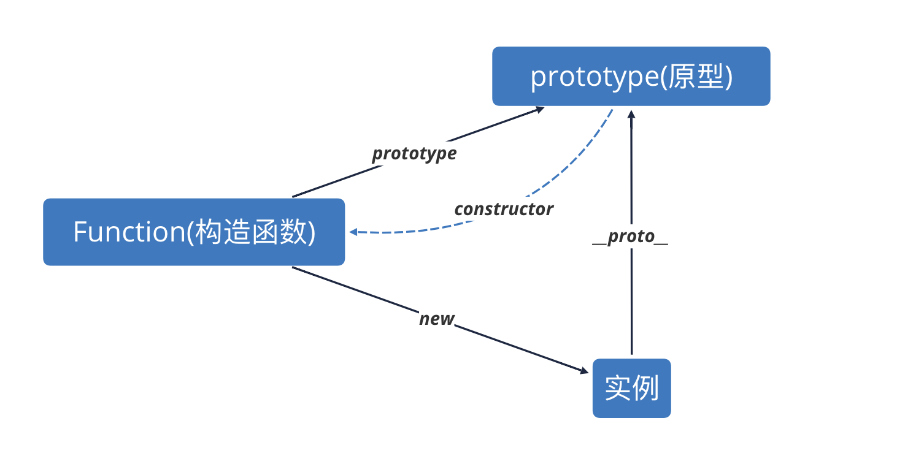

# 原型链

## 创建对象有3种方法

- ` var o1 = new Object()      var o11 = {} `
- ` var m =function(){}    var o2 = new m() `
- ` var p = {x:1, y:2}       var o3 = Object.create(p) `

## Object.create

``` js
function create(o) {
  function F(){}
  F.prototype = o;
  return new F()
}
```

## new 实现原理

1.  一个新对象被创建， 它继承自foo.prototype

2.  构造函数被执行。上下文（this）指定为这个新实例 ，相应参数会被传人

3.  如果构造函数返回一个对象， 那么这个对象会取代整个new 出来的结果, 如果没有返回对象，那么new 出来的结果就是步骤一 的新对象

``` js
function Person(name, age) {
  console.log(name, age)
  this.name = name;
  this.age = age;
}

function new2(func){
  return function(){
    var o = Object.create(func.prototype)
    var k = func.apply(o, arguments);
    if(typeof k === 'Object'){
      return k;
    }else {
      return o;	
    }
  }
}
```
## ` __proto__  `浏览器私有属性

`__proto__` 等于 当前的构造器的原型

先找p=>p.构造器=>构造器.原型

- ` p.__proto__ === Person.prototype `

- `p.__proto__.__proto__ === Object.prototype`

## constructor 构造器

因为Person.prototype = {} 覆盖了constructor 方法

`p.__proto__.constructor 会往上原型链 找,直到找到constructor方法`

`p.__proto__.constructor === p.__proto__.__proto__.constructor`


## 原型链图



## 细节


