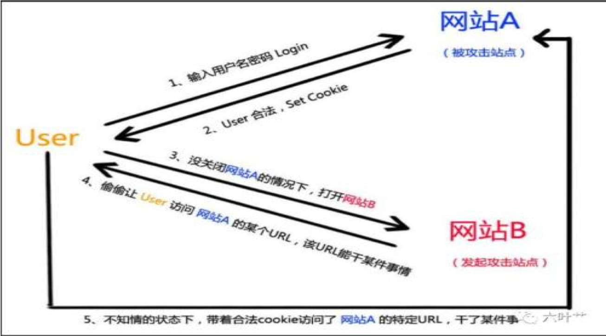

# 安全

#### [web安全ppt](http://image.qiutong.site/uploads/1562809242412-web安全.pptx)


## CSRF简述

### CSRF是什么

CSRF（Cross-site request forgery）中文全称是叫跨域请求伪造。

一般来说，是攻击者通过一些技术手段欺骗用户的浏览器去访问一个自己以前认证过的站点并运行一些操作（如发邮件，发消息，甚至财产操作（如转账和购买商品））。因为浏览器之前认证过，所以被访问的站点会觉得这是真正的用户操作而去运行。

### CSRF攻击原理



### CSRF案例

- 网站A   https://www.hongshu.com/profile/bookshelf.do
- 网站B   http://120.79.4.219:9988/click.html


### CSRF防御

- 通过 referer、token 或者 验证码 来检测用户提交。
- 尽量不要在页面的链接中暴露用户隐私信息。
- 对于用户修改删除等操作最好都使用post 操作 。
- 避免全站通用的cookie，严格设置cookie的域。


## xss简述
### xss是什么

XSS（cross-site scirpting） 跨站脚本攻击

它指的是恶意攻击者往Web页面里插入恶意html代码，当用户浏览该页之时，嵌入其中Web里面的html代码会被执行，从而达到恶意用户的特殊目的。

### XSS存储型攻击方式

- 输入框中直接输入恶意脚本。
  ``` js
  <script>alert(document.cookie)</script>
  ```
- 输入框中输入html标签，在标签中嵌入恶意脚本，如src，href，css style等。
  ``` css
  ;
  ```
- 将恶意脚本注入在event事件中，如onClick，onBlur，onerror等。
  ``` css
  
  ```

### XSS危害

- 盗用cookie获取敏感信息
- 脚本攻击
- 破坏页面布局

### XSS防御

基本原则就是 让插入的代码 不可执行。能用innerText, 就用。

- 编码
  - <     转义 &lt；
- 过滤
  - 移动dom属性 如：onerror等
  - 移除用户上传的style节点、script节点、iframe节点等
- 校正
  - 避免直接对html entity解码
  - 使用dmo parse转换 校正不配对的dom标签


## xss与CSRF区别

- CSRF比XSS漏洞危害更高。
- XSS有局限性，而CSRF没有局限性。
- XSS针对客户端，而CSRF针对服务端。
- XSS是利用合法用户获取其信息，而CSRF是伪造成合法用户发起请求。
